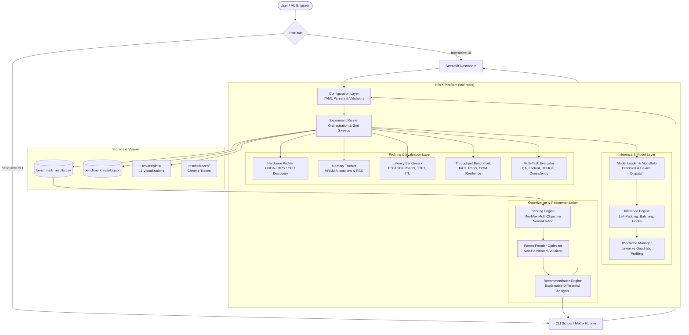

# InferX Architecture & System Design

## 1. System Overview

**InferX** is an end-to-end, production-grade LLM inference optimization, profiling, and benchmarking platform designed for machine learning systems engineers. It bridges the gap between high-level generative model APIs and the underlying systems dynamics of GPU/CPU execution: memory bandwidth saturation, compute intensity, memory hierarchy, KV-cache dynamics, and quantization trade-offs.

---

## 2. Core Subsystems

### 2.1 Model Loading & Quantization (`src/inferx/models/`)
- **`ModelLoader`**: Automatically queries compute accelerator availability with strict priority: `CUDA` $\rightarrow$ `Apple Silicon MPS` $\rightarrow$ `CPU`.
- **Token Alignment**: Causal language models require left-padding (`padding_side = 'left'`) during batch generation so newly generated autoregressive tokens align uniformly at the right boundary without attention mask leakage.
- **Quantization Manager**:
  - `FP32`: Standard baseline on CPU and legacy accelerators.
  - `FP16`: 16-bit half precision, standard for CUDA Tensor Core acceleration.
  - `BF16`: Brain floating point (1 sign, 8 exponent, 7 mantissa), preserving dynamic range without gradient underflow.
  - `INT8`: 8-bit integer quantization via `bitsandbytes` LLM.int8() vector-wise outlier decomposition on CUDA, or PyTorch native dynamic quantization (`torch.ao.quantization.quantize_dynamic`) on CPU.
  - `INT4`: 4-bit NormalFloat (NF4) / FP4 with double quantization via `BitsAndBytesConfig`.
  - **Fail-Safe Integrity**: InferX never silently downcasts or substitutes precisions. If an unsupported configuration is requested (e.g. INT4 on CPU), a descriptive `HardwareNotSupportedError` is raised.

### 2.2 Inference Engine (`src/inferx/inference/`)
- **`InferenceEngine`**: High-performance wrapper executing greedy deterministic or stochastic generation with temperature, top-p, and top-k filtering.
- **Hardware Stream Synchronization**: GPU kernel launches in PyTorch are asynchronous. Standard timers simply measure the CPU host queue time unless explicit synchronization (`torch.cuda.synchronize()` or `torch.mps.synchronize()`) is executed immediately before starting and after stopping high-resolution timers (`time.perf_counter()`).
- **Granular Token Profiling**:
  - Prefill Phase: Computes the first token from the entire prompt prompt sequence. Latency here represents **Time-To-First-Token (TTFT)**.
  - Decoding Phase: Subsequent autoregressive forward steps generate single tokens one-by-one. InferX measures each step individually to compute the **Inter-Token Latency (ITL)** distribution.

### 2.3 Benchmarking Suite (`src/inferx/benchmark/`)
- **`LatencyBenchmark`**: Discards initial warmup iterations (mitigating PyTorch JIT tracing, CUDA kernel compilation, and dynamic memory allocation jitter). Computes mean, median, min, max, std, p50, p90, p95, and p99 percentiles.
- **`ThroughputBenchmark`**: Evaluates multi-request concurrency across batch sizes $[1, 2, 4, 8, 16]$. Automatically catches `torch.cuda.OutOfMemoryError` and continues experiment execution without crashing the suite.
- **`MemoryTracker`**: Context manager that records baseline allocated memory, forces garbage collection (`gc.collect()`), resets peak allocation statistics (`torch.cuda.reset_peak_memory_stats()`), and computes exact memory deltas.

### 2.4 Task-Aware Quality Evaluation (`src/inferx/evaluation/`)
Unlike naive perplexity-only benchmarks, InferX implements task-aware evaluation across 5 canonical LLM use cases:
1. **Question Answering**: Evaluated via normalized Exact Match (EM) and token overlap F1 score.
2. **Short Factual Recall**: Evaluated via token F1.
3. **Simple Reasoning**: Evaluated via numerical Exact Match.
4. **Summarization**: Evaluated via ROUGE-1, ROUGE-2, and ROUGE-L f-measure.
5. **Instruction Following**: Evaluated via structured entity matching.
6. **Deterministic Consistency**: Evaluates greedy decoding stability across duplicate runs.

### 2.5 Multi-Objective Optimization & Pareto Recommendations (`src/inferx/optimization/`)
Inference optimization is an intrinsically multi-dimensional trade-off:
$$\text{Score} = \frac{w_q \cdot Q_{\text{norm}} + w_t \cdot T_{\text{norm}} + w_l \cdot L_{\text{norm}} + w_m \cdot M_{\text{norm}}}{w_q + w_t + w_l + w_m}$$
where latency ($L$) and memory ($M$) are inverted during Min-Max normalization so that lower consumption yields higher scores.

The **Pareto Frontier Optimizer** isolates non-dominated configurations where no alternative setting can improve one metric without degrading another. The **Recommendation Engine** generates explainable, data-backed reports contrasting the optimal configuration against an FP16 Batch-1 baseline.
